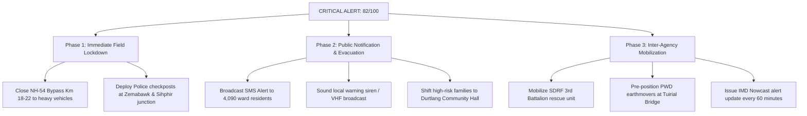

# 📑 DISTRICT EMERGENCY DISASTER ASSESSMENT REPORT
**AI-Based Early Warning & Landslide Risk Monitoring System for Northeast India (NE-LENS)**  
**Target Corridor:** Tuirial & Durtlang Slope Corridor, Aizawl District, Mizoram  
**Issuing Authority:** District Disaster Management Authority (DDMA) & State Disaster Management Authority (SDMA)  
**Classification:** Operational Decision Support Document | **Incident Priority:** P1 — CRITICAL  

---

## 1. Executive Summary

| Assessment Metric | Monitored Status / Value | Operational Interpretation |
| :--- | :--- | :--- |
| **Composite Landslide Risk Score** | **82 / 100** | **CRITICAL (Red Alert)** |
| **Predicted Initiation Window** | **Next 6 Hours** | Imminent slope failure / debris flow hazard |
| **Hazard Buffer Radius** | **2.5 km** | Delineated zone of direct runout & debris deposition |
| **Population at Direct Risk** | **4,820 Residents** (Est.) | Riparian and toe-slope habitations across 3 villages |
| **Critical Lifelines Affected** | **NH-54 Bypass, 2 Feeder Links, 2 Bridges, 1 PHC** | Primary logistics & evacuation corridor |

---

## 2. Nine-Factor Landslide Mechanism & Risk Matrix

This risk evaluation models the interaction of static predisposing site factors, anthropogenic aggravators, and dynamic environmental triggers.

| Factor | What Happens Mechanically | Monitored Field Metric | Risk Multiplier | Status / Evaluation |
| :--- | :--- | :--- | :---: | :--- |
| **🌧️ Heavy Rainfall** | Water infiltrates soil matrix, increases unit weight ($\gamma_{sat}$), and builds positive pore water pressure ($u$). | **146 mm / 24h**<br>(Peak: 18 mm/hr) | **↑↑↑** *(Very High)* | **Active Primary Trigger:** Surpassed antecedent threshold of 100 mm/24h. |
| **💧 High Soil Moisture** | Soil saturation reaches capacity, eliminating matric suction; effective shear strength ($\sigma'$) drops sharply. | **82% Moisture**<br>(Saturation: 88%) | **↑↑↑** *(Very High)* | **Critical Overburden State:** Clayey matrix transitioned into plastic/liquid state. |
| **⛰️ Steep Slope** | Gravitational downslope shear stress ($\tau_d = \gamma z \sin \beta$) drastically overcomes shear resistance. | **38° Slope Angle**<br>(Local scarps $>50^\circ$) | **↑↑↑** *(Very High)* | **Kinematic Instability:** Natural repose angle of weathered shale ($\approx 28^\circ$) heavily exceeded. |
| **🪨 Weak Soil & Rock** | Interbedded tertiary shale, siltstone, and weathered sandstone disintegrate rapidly under moisture. | **Surma Group Formation**<br>(GSI Susceptibility: HIGH) | **↑↑** *(High)* | **High Lithological Vulnerability:** Intensely jointed, fractured rock mass with low cohesion. |
| **🌳 Loss of Vegetation** | Removal of forest canopy destroys mechanical root anchoring ($c_r$) and allows rapid surface erosion. | **NDVI: 0.38**<br>(Deforested cut zone) | **↑** *(Moderate)* | **Cohesion Loss:** Lost estimated 8–12 kPa of apparent root tensile reinforcement. |
| **🏗️ Hill Cutting & Construction** | Unregulated toe excavation for highway widening and terracing removes lateral toe-buttress support. | **NH-54 Cut Faces**<br>(Sub-vertical $>65^\circ$) | **↑↑** *(High)* | **Severe Anthropogenic Aggravator:** Oversteepened road benching induced 15cm crown tension cracks. |
| **🌊 River Erosion & Scour** | High monsoon discharge in Tuirial River scours and undercuts the bottom toe of the debris apron. | **Tuirial Stream Cresting**<br>(High velocity scour) | **↑↑** *(High)* | **Basal Support Removal:** Promotes progressive upslope retrogressive failure. |
| **🌍 Previous Landslides** | Old slip planes retain reduced *residual* friction angles ($\phi'_r < \phi'_p$); reactivation requires far less energy. | **7 Past Events in Basin**<br>(4 inside 2.5 km buffer) | **↑↑** *(High)* | **Relict Weakness Planes:** Most recent debris flow occurred just 18 days ago on this exact corridor. |
| **🌎 Earthquake & Seismic Shaking** | Dynamic horizontal cyclic acceleration ($k_h$) destabilizes saturated slopes (Zone V seismicity). | **Seismic Zone V (High)**<br>(Active Indo-Burma subduction) | **↑↑↑** *(Very High)* | **Latent Shaking Hazard:** Even a minor micro-tremor ($M \ge 3.2$) would trigger catastrophic liquefaction. |

---

## 3. Geotechnical Factor Contribution Breakdown

```
[🌧️ Heavy Rainfall (146mm)]       ████████████████████████  32% (Dynamic Trigger)
[💧 High Soil Moisture (82%)]      ███████████████████       26% (Strength Depletion)
[⛰️ Steep Slope (38°)]             ██████████████            18% (Gravitational Driving Force)
[🏗️ Hill Cutting & Road Toe Scarp] █████████                 11% (Anthropogenic Destabilizer)
[🌍 Previous Relict Slips (7)]     ██████                    7%  (Pre-existing Failure Planes)
[🪨 Weak Weathered Shale & Litho]  ████                      4%  (Low Inherent Cohesion)
[🌊 River Scour & Deforestation]   ██                        2%  (Basal Undercutting & Exposure)
```

> [!IMPORTANT]
> **PRIMARY HAZARD CONCLUSION:**
> The slope has reached a **Factor of Safety (FoS) $< 1.0$**. The fatal convergence of **146 mm antecedent rainfall** with **82% soil moisture** on an already compromised **38° road-cut slope** makes immediate debris movement inevitable within the forecasted +58 mm rain window.

---

## 4. Exposure & Vulnerability Assessment

### A. Populated Settlements within 2.5 km Radius
1. **Tuirial Veng** (Lower Toe Zone): ~1,840 inhabitants | High risk of mudflow deposition and valley flooding.
2. **Durtlang North** (Ridge & Crest Spur): ~2,120 inhabitants | Immediate risk of crown tension retrogressive collapse.
3. **Sihphir Outskirts** (Flank Valley): ~860 inhabitants | Threatened by secondary debris runout and culvert blockages.
* **Total Estimated Exposure:** **4,820 Individuals** (680 Children / Elderly needing priority transport).

### B. Transportation & Lifeline Infrastructure
- **National Highway NH-54 Bypass (Km 18–22):** Lifeline commercial road; 15cm crown cracks observed at Km 19.4.
- **Tuirial RCC River Bridge & Chite Lui Box Culvert:** High risk of siltation choke, water ponding, and abutment scour.
- **Durtlang Primary Health Centre (PHC):** Requires emergency power backup & patient transfer readiness.
- **Schools (2):** Govt Middle School Tuirial and Durtlang High School designated for immediate class suspension.

---

## 5. Standard Operating Procedures (SOP) & Authority Action Plan



### Action Checklist for District Magistrate / DDMA:
1. `[URGENT]` **Traffic Diversion:** Divert all heavy commercial vehicles off the NH-54 bypass via the Zemabawk inner artery.
2. `[URGENT]` **Field Verification:** PWD Highway Engineer to verify tension crack propagation at Km 19.4 every 30 minutes.
3. `[URGENT]` **Public Warning Dissemination:** Broadcast bilingual emergency advisories (Mizo & English) to Village Disaster Management Committees.
4. `[HIGH]` **Shelter Readiness:** Open Durtlang Community Hall and Model School as temporary dry transit camps.
5. `[HIGH]` **Drainage Relief:** Clear clogged culverts and ditches to channel torrential runoff away from the active head scarp.

---

## 6. Official Sign-Off & Routing

- **Report Generated By:** NE-LENS Automated Geotechnical Intelligence Engine
- **Corroborating Telemetry:** IMD Automated Weather Station #04 + Geological Survey of India (GSI) Susceptibility Atlas
- **Distribution:**
  - District Disaster Management Officer (DDMA Aizawl)
  - Superintendent of Police (Traffic & Law Enforcement)
  - Executive Engineer, Public Works Department (PWD National Highways)
  - Commandant, State Disaster Response Force (SDRF Mizoram)
  - Chairman, Village Disaster Management Committees (Tuirial, Durtlang, Sihphir)
